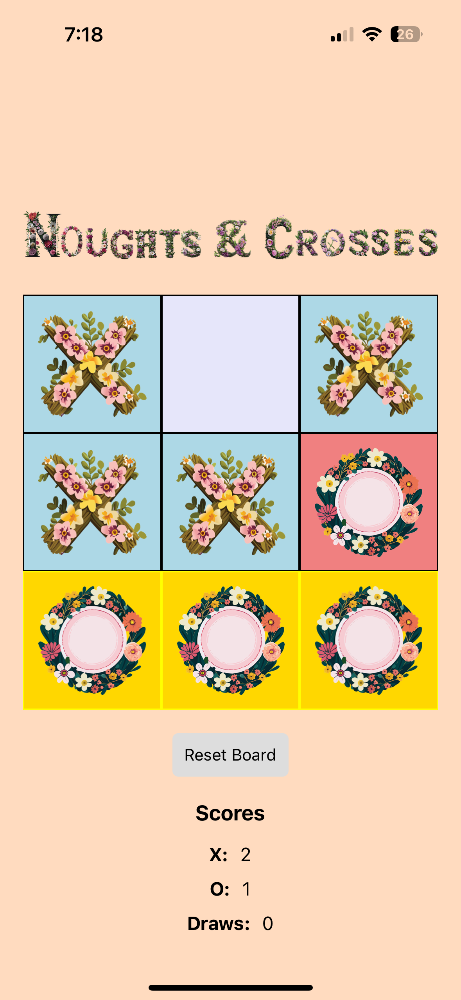

# Naughts and Crosses Expo/React Native App

This is a simple Tic-Tac-Toe game built with React Native using Expo. This app is an adaptation of a web-based version I created previously, intended to help me get familiar with the basics of React Native.

## Features

- Play against another player or the computer (Not AI just Math.random() 😁)
- Track scores for X, O, and draws
- Visual indication of the winning combination
- Simple and intuitive UI
- Reset the game board to start a new match

## Screenshots

